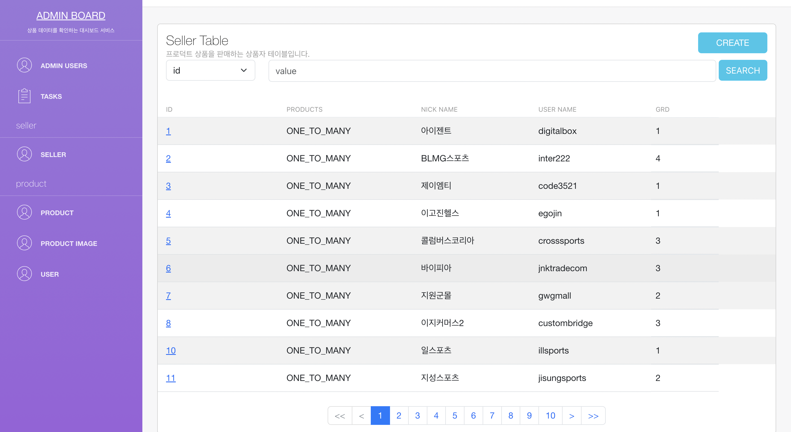
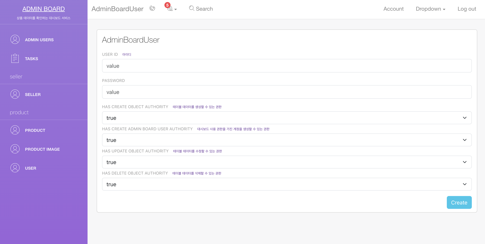

# Admin Board
Admin Board is a powerful management page library designed for the Spring Framework. It provides comprehensive features to facilitate CRUD operations (Create, Read, Update, Delete) on database records, offering seamless management of data stored in your application.

## Key Features
`Effortless CRUD Operations`: Admin Board simplifies the management of database records by providing a user-friendly interface for effortless CRUD operations. It allows you to effortlessly create, read, update, and delete data with minimal effort.

`Automatic Table Recognition`: Admin Board automatically recognizes the structure of your database tables and generates corresponding management pages. This eliminates the need for manual configuration, saving you valuable development time.

`Customizable Dashboard`: The library offers a highly customizable dashboard where you can showcase essential information about your application. You have complete control over the layout, appearance, and functionality of the dashboard to meet your specific requirements.

`Secure Access Control`: Admin Board seamlessly integrates with Spring Security, enabling you to enforce access control and define user roles and permissions. This ensures that only authorized users can access and modify the management pages securely.

`Extensible and Flexible`: Admin Board is designed to be highly extensible and flexible, allowing you to easily adapt it to the unique needs of your application. You can customize various aspects, including entity mappings, column configurations, and UI components, to tailor the library precisely to your requirements.

<br />

## How To Use
There are two ways to use the library.
One is using `mavenLocal` and the other is `using modules distributed with Jitpack`.

<br />

### MavenLocal
#### 1. Clone the Repository
Clone the Admin Board repository to your local machine using the following command:
```bash
git clone https://github.com/twentiethcenturygangsta/admin-board.git
```
#### 2. build
Navigate to the cloned directory and build the project by executing the following command:
```bash
./gradlew clean PublishToMavenLocal
```
This command will clean the project and publish the artifacts to your local Maven repository.

After completing these steps, you can include the Admin Board library in your project by adding the appropriate dependency configuration in your project's pom.xml or build.gradle file.

```build.gradle
    repositories {
        mavenLocal()
        mavenCentral()
    }
    
    ...
    
    dependencies {
        ...
        implementation 'com.github.twentiethcenturygangsta:admin-board:{version}'
    }
```

<br />

### Basic Step

#### 1. Config
Admin Board Configuration
- Add a detailed explanation of how to create the AdminBoardClient bean.
- Provide more detailed instructions on setting up UserCredentials and AdminBoardInfo.

  - `UserCredentials` : Settings for accounts that can use the dashboard.
  - `AdminBoardInfo` : You can enter basic information about the dashboard. Basic information is exposed on the dashboard screen.
```java
@Configuration
public class AdminBoardConfig {

    @Bean
    public AdminBoardClient adminBoardClient() {
        UserCredentials userCredentials = UserCredentials.builder().memberId("aaa").password("1234").build();
        AdminBoardInfo adminBoardInfo = AdminBoardInfo.builder().description("상품 데이터를 확인하는 대시보드 서비스").title("ADMIN BOARD").version("1.0.0").build();

        return AdminBoardClient.builder().adminBoardInfo(adminBoardInfo).userCredentials(userCredentials).build();
    }
}
```
<br />

#### 2. EnableAdminBoard
- Provide a more detailed explanation of how to enable Admin Board using the @EnableAdminBoard annotation.
- Add specific examples for both single-module and multi-module projects.

If it is a single module, just attach `@EnableAdminBoard` annotation.
```java
@EnableAdminBoard
public class ApiApplication {

    public static void main(String[] args) {
        SpringApplication.run(ApiApplication.class, args);
    }
}
```

For multi-modules, add the module path in basePackages, which is an `@EnableAdminBoard` annotation property.
```java
@EnableAdminBoard(basePackages = {"com.github.database", "com.github.domain"})
public class ApiApplication {

    public static void main(String[] args) {
        SpringApplication.run(ApiApplication.class, args);
    }
}
```
<br />

#### 3. AdminBoardEntity and AdminBoardColumn
- Explain how to add entities to the dashboard using the `@AdminBoardEntity` annotation.
- Provide a more detailed explanation of using the `@AdminBoardColumn` annotation to describe the properties of each entity.
- Supplement the explanation with the `Product` entity as an example.
```java
@Entity
@Getter
@NoArgsConstructor(access = AccessLevel.PROTECTED)
@AdminBoardEntity(group = "product", description = "프로덕트 상품에 대한 테이블입니다.")
public class Product implements Serializable {

    private static final int STOCK_MINIMUM = 0;

    @Id
    @GeneratedValue(strategy = GenerationType.IDENTITY)
    private Long id;

    @JsonBackReference
    @ManyToOne(fetch = FetchType.LAZY)
    @JoinColumn(name = "seller_id")
    private Seller seller;

    @JsonManagedReference
    @OneToMany(mappedBy = "product", cascade = CascadeType.ALL)
    private List<ProductImage> productImages = new ArrayList<>();
    
    @AdminBoardColumn(description = "상품 고유 식별 코드")
    @Column(unique = true)
    private String code;

    @AdminBoardColumn(description = "상품명")
    private String name;
    
    private int price;
    
    private int salePrice;
    
    @AdminBoardColumn(description = "평점 데이터")
    private String rating;
    
    @AdminBoardColumn(description = "상품 소개 페이지 url")
    private String detailPageUrl;

    @AdminBoardColumn(description = "상품 배송 방식")
    private String delivery;
    private int reviewCount;
    private int buySatisfy;
    private String isMinor;

    @ColumnDefault("100")
    private Long quantity;

    @Builder
    public Product(Long id, Seller seller, String code, String name, int price, int salePrice, String rating, String detailPageUrl, String delivery, int reviewCount, int buySatisfy, String isMinor) {
        this.id = id;
        this.seller = seller;
        this.code = code;
        this.name = name;
        this.price = price;
        this.salePrice = salePrice;
        this.rating = rating;
        this.detailPageUrl = detailPageUrl;
        this.delivery = delivery;
        this.reviewCount = reviewCount;
        this.buySatisfy = buySatisfy;
        this.isMinor = isMinor;
        this.quantity = 100L;
    }

    public void decrease(Long quantity) {
        if (hasQuantity(quantity)) {
            this.quantity = this.quantity - quantity;
        } else {
            throw new RuntimeException("does not decrease product's quantity");
        }
    }

    public boolean hasQuantity(Long quantity) {
        return this.quantity - quantity >= 0;
    }
}
```

<br />
<br />

## Example Views
### Login View
Log in using the super admin account registered by the developer.


<br />

### Table View
You can access lists of entity objects for each table, with the ability to view up to 10 objects per page. The table view supports the display of up to 6 columns, providing a comprehensive overview of the data.


<br />

### Create Views
You can create objects by entering values that correspond to their types. When inserting objects with associated relationships, you can use search functionality to select the appropriate entities.
#### Create view

#### Create Search View


<br />

### Object Detail View
view the details of all fields for an object, providing comprehensive information about each field.


<br />

### Admin User Views
#### Admin User Create View
create an admin user account with limited permissions.

#### Admin User Table View
You can access lists of entity objects for Admin User table, with the ability to view up to 10 objects per page. The table view supports the display of up to 6 columns, providing a comprehensive overview of the data.
